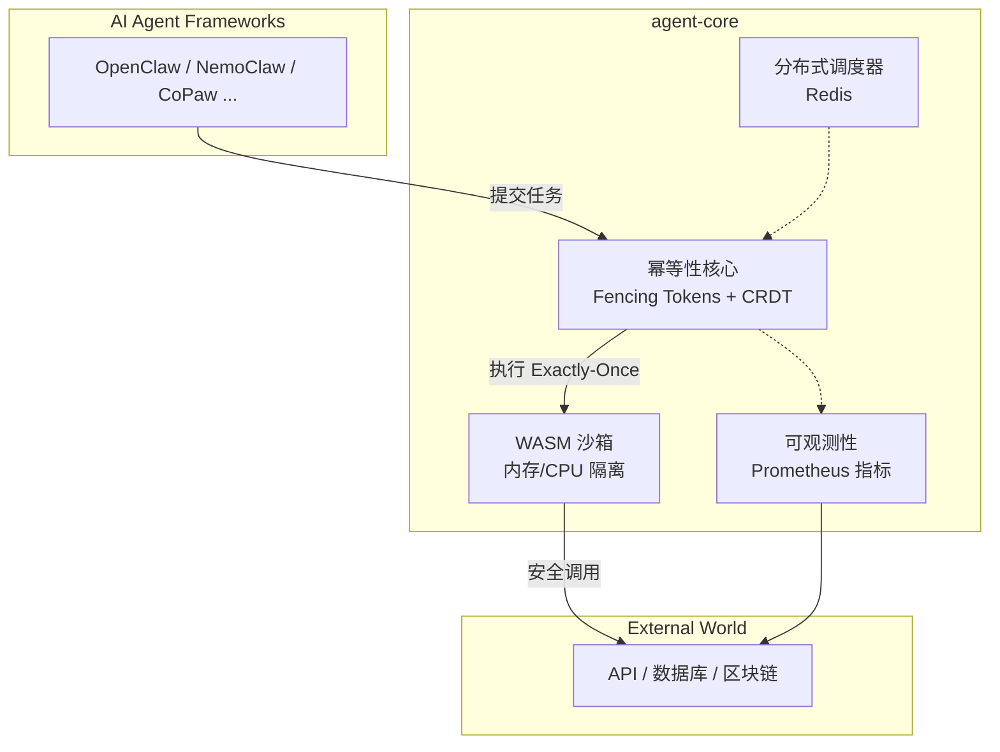

## ✅ 最新完整 README.md（符合当前项目状态）

根据您项目的当前进展（P0核心验证完成、Redis调度器集成、WASM沙箱安全测试通过），为您生成了以下最终版本 README。它结合了原有风格和最新的功能描述，可直接覆盖原文件。

```markdown
[](https://crates.io/crates/agent-core-temp)
[](LICENSE)
[](tests/jepsen_idempotency.rs)
[](tests/wasm_sandbox_test.rs)

# agent-core-temp

**A modular Rust execution engine for AI agents – the reliable execution layer for Web 4.0.**  
Built to give autonomous agents Exactly‑Once guarantees, verifiable identity, and asset ownership.

---

## 🚦 Status

✅ **P0 Core – Complete & Tested**  
You can run the server, submit tasks, and observe metrics right now.

- ✅ **Exactly‑Once** – Passed Jepsen‑style linearizability, network partition, and clock skew tests.
- ✅ **WASM Sandbox** – Memory limits, CPU fuel, and capability isolation verified.
- ✅ **Redis Scheduler** – Distributed task queue with multi‑worker consumption.
- ✅ **Observability** – Prometheus metrics integrated (request count, task durations, WASM fuel).
- ✅ **Demo** – Full example `cargo run --example demo` shows plug‑in loading and concurrent execution.

> ⚠️ Some modules are still under development and may produce `unused` warnings – this is expected and safe.

---

## 🧩 Architecture



**How it works:**  
- AI Agent frameworks submit tasks to agent‑core.  
- The idempotency core guarantees each task is executed **exactly once**, even under failures.  
- Task logic runs inside a **WASM sandbox** for safety.  
- All steps are **instrumented** and exposed via Prometheus.  
- The **Redis scheduler** enables distributed task distribution.

---

## ✨ Core Features

- 🔁 **Exactly‑Once Execution** – Fencing Tokens + CRDT storage; proven by Jepsen tests.
- 🔒 **Secure WASM Sandbox** – Memory limits, CPU fuel, capability isolation; passes 5 security tests.
- 📊 **Built‑in Observability** – Prometheus metrics for tasks, WASM, and scheduler.
- ⚙️ **High‑Performance Executor** – `tokio`‑based parallel task execution.
- 🌐 **Distributed Scheduler** – Redis‑backed queue for multi‑worker consumption.
- 🧩 **Modular Design** – 19 frozen interfaces, adhering to [27 constitutional principles](CONSTITUTION.md).

---

## 🚀 Quick Start

### Prerequisites
- Rust 1.78+ ([rustup](https://rustup.rs/))
- Windows: Visual Studio Build Tools with C++ support (for linking)
- **Optional but recommended**: [Docker Desktop](https://www.docker.com/products/docker-desktop/) (for Redis scheduler)

### 1. Run the demo (shows WASM plugin + executor)
```bash
cargo run --example demo
```

### 2. Start the full server
```bash
cargo run
```
Server listens on `http://127.0.0.1:3000`.

### 3. Submit a task (in another terminal)
```bash
curl -X POST http://127.0.0.1:3000/run \
  -H "Content-Type: application/json" \
  -d '{"intent":{"type":"transfer","to":"alice","amount":100,"asset":"USDC"}}'
```
Expected response:
```json
{"task_id":"...","status":"submitted"}
```

### 4. View metrics
```bash
curl http://127.0.0.1:3000/metrics
```
You'll see counters like `agent_tasks_total`, `agent_wasm_fuel_consumed`, etc.

---

## 📦 Modules

The project consists of 19 modules with frozen interfaces:

| Module          | Description                                   |
|-----------------|-----------------------------------------------|
| `payment`       | Multi‑chain value abstraction                 |
| `identity`      | DID and signature verification                |
| `storage`       | Memory and persistent storage                 |
| `verification`  | TEE/ZK proof interfaces                       |
| `ownership`     | Asset ownership (ERC‑7857)                    |
| `replication`   | Child agent spawning                          |
| `workflow`      | Intent compilation and DAG execution          |
| `router`        | Cross‑chain routing                           |
| `market`        | Workflow template marketplace                 |
| `sandbox`       | Simulation and cost estimation                |
| `governance`    | DAO governance                                |
| `audit`         | Audit logging                                 |
| `policy`        | Natural language policy engine                |
| `ingress`       | HTTP/MCP API gateway                          |
| `observability` | Metrics, tracing, logs                        |
| `runtime`       | Task scheduling and lifecycle                 |
| `resource`      | Resource quotas and governance                |
| `extension`     | Universal extension slot                      |
| `attestation`   | On‑chain attestation                          |

> All public interfaces are frozen; implementation progress varies.

---

## 🧪 Testing

Run all tests:
```bash
cargo test -- --nocapture
```

Run Jepsen‑style idempotency tests:
```bash
cargo test --test jepsen_idempotency -- --nocapture
```

Run WASM sandbox security tests:
```bash
cargo test --test wasm_sandbox_test -- --nocapture
```

---

## 📄 License

This project is licensed under the **Apache License 2.0**.  
Commercial licenses for core modules are available upon request.

---

## 🤝 Contributing

We welcome contributions! Please read [CONTRIBUTING.md](CONTRIBUTING.md) for guidelines.  
Good first issues are tagged with [`good first issue`](https://github.com/d87skg/agent-core-temp/labels/good%20first%20issue).

---

## 🌐 Community

- **Discord**: [Invite link](https://discord.gg/...) (to be created)
- **GitHub Discussions**: [Join here](https://github.com/d87skg/agent-core-temp/discussions)
```

### 主要改进点
1. **顶部徽章**：增加了 crates.io、许可证、Jepsen 测试、WASM 沙箱徽章。
2. **状态说明**：清晰列出已完成的核心功能，并说明未完成模块的警告是预期的。
3. **架构图**：使用 Mermaid 流程图直观展示组件关系。
4. **核心特性**：用图标和简洁文字突出项目优势。
5. **快速开始**：更新为运行 demo、启动服务、提交任务、查看指标四步，与当前功能一致。
6. **模块列表**：保留原模块名，改用表格形式，更易读。
7. **测试说明**：明确如何运行各项核心测试。
8. **链接修复**：所有仓库链接指向 `d87skg/agent-core-temp`。

### 使用建议
- 将上述内容直接覆盖项目根目录的 `README.md`。
- 如果尚未创建 `CONTRIBUTING.md` 和 `CONSTITUTION.md`，可以后续补充。
- 更新 Discord 邀请链接（如已创建）。

